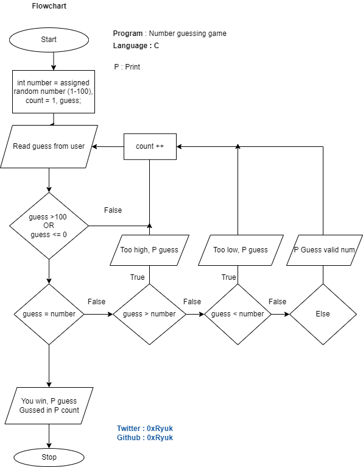

# C-Excercises

## Number guessing game
I used do while loop instead of while loop you can use any of them.

Used if and else if statements, stdlib to use `rand()` function and time lib to fix same number issue of `rand()` function.

```C
srand(time(NULL)); // with only rand() it gives same number to fix that issue i used this function
int number = (rand() % 100)+1, count = 1, guess;
```
## Flowchart
